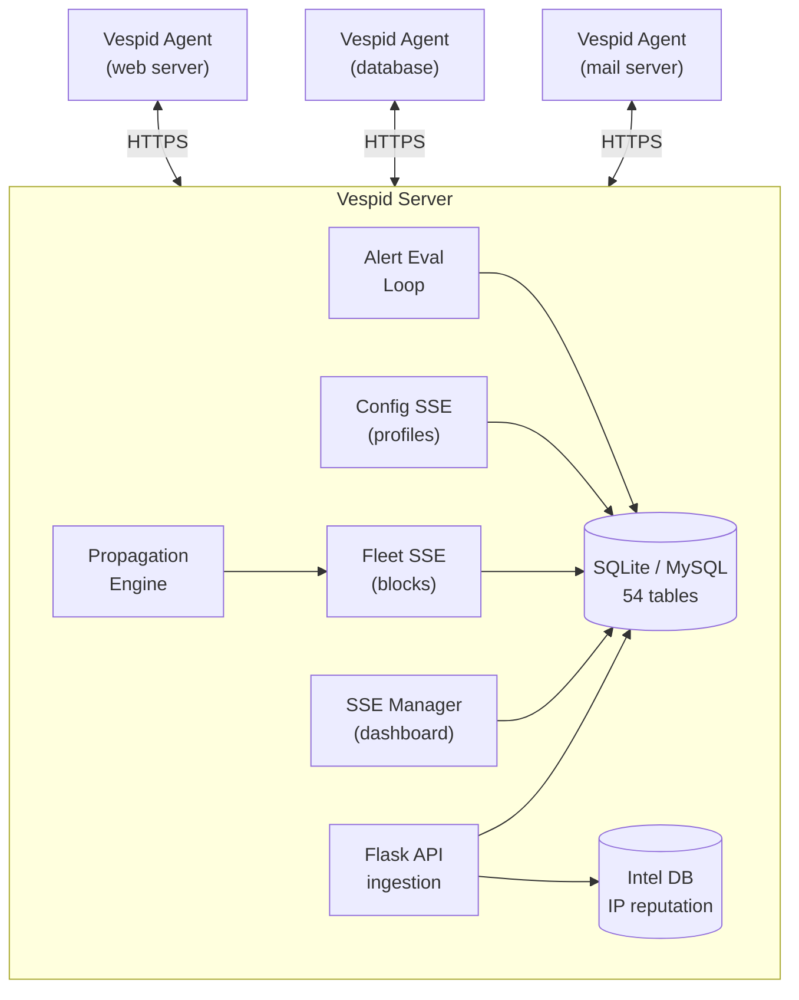
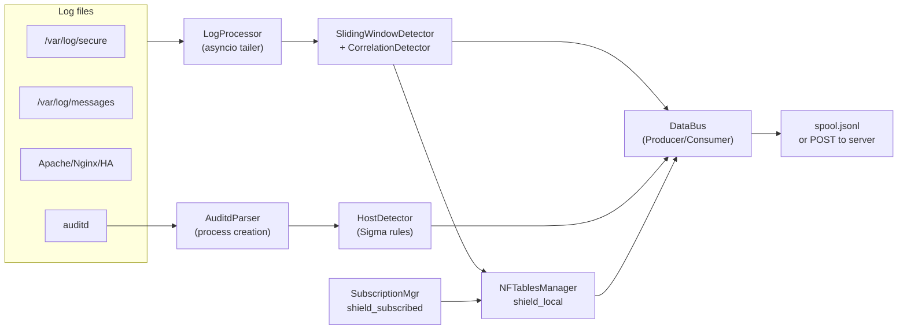
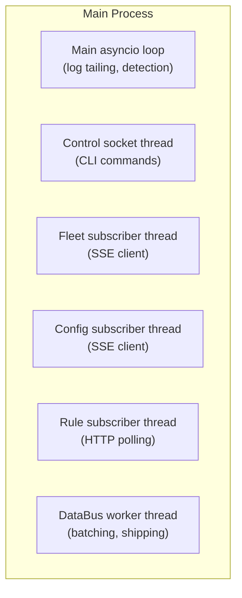
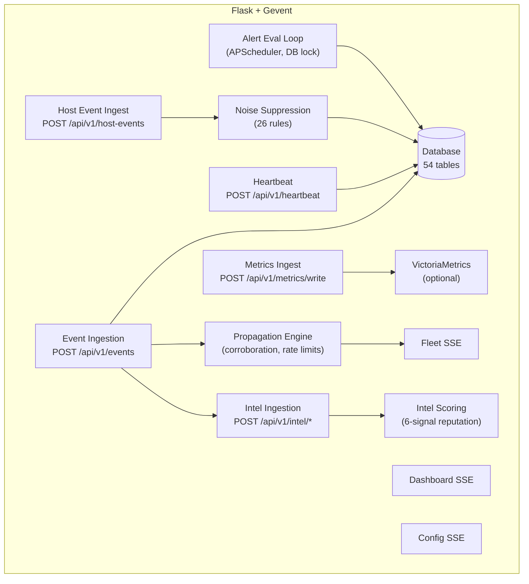

# Architecture

## System overview

## Agent internals

## Agent threading model

The agent uses dedicated threads with separate event loops to avoid
Python 3.12 asyncio starvation issues.

See [Threading Architecture](THREADING_ARCHITECTURE.md) for details.

## Background tasks

| Component | Role |
|-----------|------|
| EnrollmentClient | Auto-enrollment + credential rotation |
| FleetBlockSubscriber | Fleet SSE channel listener |
| RuleSubscriber | Polls `/api/v1/rules/distribution` |
| ConfigSubscriber | Config SSE (server-managed mode) |
| ControlServer | UNIX socket for CLI |
| Health check | Rebuilds nftables table if missing (every 30s) |
| GC loop | Prunes stale detector/correlation/recidive data (every 10 min) |
| Expiry reaper | Removes expired in-memory blocks (every 60s) |
| Fleet queue drainer | Retries offline block reports with exponential backoff |
| Activity tracker | Logs 24h activity summaries |

## Server internals

### SSE channels

The server runs three independent SSE managers, each with its own
fan-out and reconnection buffer:

| Channel | Path | Auth | Purpose | Buffer |
|---------|------|------|---------|--------|
| Dashboard | `/api/v1/events/stream` | Session | Live event feed for web UI | 500 |
| Fleet | `/api/v1/fleet/blocks/stream` | Bearer | Block propagation to agents | 1000 |
| Config | `/api/v1/config/stream` | Bearer | Profile push to managed agents | 1000 |

For multi-worker Gunicorn deployments, a Redis-backed SSE implementation
ensures fan-out across all workers.

## Data flow: detection

1. Log line arrives → LogProcessor parses it into a `ParsedLine`
2. `ParsedLine` fed to `SlidingWindowDetector` and `CorrelationDetector`
3. On threshold breach → `Detection` event published to DataBus
4. DataBus publishes to NFTablesManager (apply block) and server (telemetry)
5. If fleet-enabled, block report sent to server for corroboration
6. Server's Propagation Engine evaluates → approved blocks published via Fleet SSE
7. Subscribed agents apply fleet blocks to local nftables

## Data flow: host threat detection

1. auditd emits SYSCALL/EXECVE/PROCTITLE records to `/var/log/audit/audit.log`
2. AuditdParser assembles multi-line records into `HostEvent` objects
3. HostDetector matches against 115 Sigma-derived rules
4. Matches are scored per-host with exponential time decay
5. Events shipped to server via DataBus
6. Server stores events, computes scores, renders Kill Chain Timeline

## Data flow: intelligence pipeline

1. Block/sighting events arrive from agents
2. Intel service creates or updates `ip_intel` record
3. Scoring engine computes reputation (6 weighted signals + multi-vector bonus)
4. Search and analytics available via dashboard and CLI

## Data flow: server-managed config

1. Admin updates config profile in dashboard
2. Server creates a rollout (immediate, canary, or staged)
3. Managed agents connected to Config SSE receive the update
4. Agent applies config atomically with rollback on failure
5. Agent reports health status on next check-in

## Data flow: rule distribution

1. Admin enables/disables rules on server
2. Revision counter increments
3. Agents poll `GET /api/v1/rules/distribution` with `If-None-Match`
4. Server returns 304 (no change) or full rule set with per-node filtering
5. Agent merges with local config and hot-reloads detector

## Data flow: alerting

1. Timer triggers eval loop every 60 seconds (multi-worker safe via DB lock)
2. Eval loop acquires DB-based singleton lock (multi-worker safe)
3. Each enabled rule evaluated against PromQL or check_result data
4. State transitions (OK → firing, firing → OK) trigger notifications
5. Notifications dispatched via configured channels (Slack, email, webhook, PagerDuty)
6. Cooldown and debounce prevent flapping

## Key design decisions

| Decision | Rationale |
|----------|-----------|
| **Flask + HTMX + SQLite** | No JS build tooling; zero-config database |
| **Gevent workers** | Thousands of idle SSE connections on one OS thread |
| **nftables (not iptables)** | Modern Linux firewall; per-element TTL in kernel |
| **Sliding-window detection** | O(1) amortized per event; handles both fast and slow attacks |
| **Correlation detection** | Catches multi-vector recon below individual thresholds |
| **Dedicated SSE channels** | Isolated fan-out for dashboard, fleet, and config |
| **Fleet-wide recidive** | Server escalates fleet block TTL for repeat offenders using Intel DB counters |
| **Migration-based schema** | Incremental ALTER TABLE on startup; never breaks existing DBs |
| **DB abstraction layer** | Same queries work on SQLite and MySQL transparently |
| **Per-node rule filtering** | Nodes only receive rules for parsers they actually monitor |
| **Dedicated threads** | Avoids Python 3.12 asyncio starvation with `call_soon_threadsafe` |
| **DB-based eval lock** | Alert eval loop safe across multiple Gunicorn workers |
| **On-disk fleet queue** | Block reports survive agent restarts when server is unreachable |
