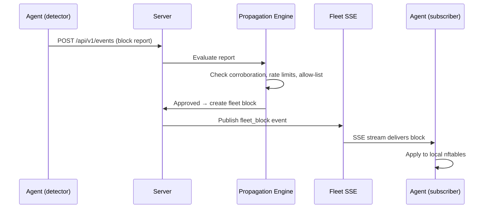

# Fleet Blocklist Sharing

Fleet blocklist sharing allows security events detected on one node to
protect all nodes in the fleet.  When an agent blocks an IP, it reports the
block to the server.  The server's **Propagation Engine** evaluates the report
and, if approved, distributes the block to all subscribed agents in real time
via a dedicated SSE channel.

## How it works



## Propagation Engine

The Propagation Engine is the decision layer that determines whether a
block report from a node should become a fleet-wide block.

### Corroboration

By default, a single node's report is sufficient to create a fleet block
(`corroboration_threshold: 1`).  Increase the threshold to require multiple
independent nodes to report the same IP before propagation.

Reports within the `corroboration_window_seconds` window are counted together.

### Rate limiting

| Limit | Default | Description |
|-------|---------|-------------|
| `max_fleet_blocks_per_hour` | 100 | Global cap on new fleet blocks per hour |
| `max_reports_per_node_per_hour` | 50 | Per-node cap to prevent a noisy node from flooding the fleet |

### Allow-list

IPs on the fleet allow-list are never propagated.  Manage it via the
dashboard (**Security → Fleet → Allow-List**) or CLI:

```bash
vespid-cli fleet allow 10.0.0.0/8 --reason "internal network"
vespid-cli fleet allowlist
```

### Excluded event types

Certain event types can be excluded from propagation entirely via the
`excluded_event_types` configuration list.

## Fleet SSE channel

Agents subscribe to the fleet block SSE stream at
`GET /api/v1/fleet/blocks/stream` using their API key.  The stream delivers:

- **`fleet_block`** events — block or unblock directives with IP, reason,
  TTL, and originating node
- **Keepalive comments** every 15 seconds
- **Reconnection replay** via `Last-Event-ID` with a 1000-event history buffer

On the agent side, the `FleetBlockSubscriber` handles:

- Automatic reconnection with exponential backoff (5s initial, 5min max)
- Keepalive timeout detection (60s without data triggers reconnect)
- Periodic fallback sync via REST polling every 5 minutes
- Local allow-list filtering (`fleet_local_allow_list` in agent config)

## Fleet block recidive

The server automatically escalates the TTL of fleet blocks for repeat
offenders.  When a block report arrives, the Propagation Engine queries
the Intelligence database (`ip_intel.total_times_blocked`) and maps the
count to escalated TTL tiers:

| Prior blocks | Fleet block TTL |
|-------------|-----------------|
| 0 (first offense) | 1 day |
| 1 | 3 days |
| 2 | 7 days |
| 3+ | 30 days |

After a configurable decay period (`fleet_recidive_decay_seconds`, default
30 days) with no activity, the offense counter resets.

This operates independently from node-level recidive (`recidive_tiers` in
agent config), which escalates local block duration.

## Offline queuing

When the server is unreachable, block reports are persisted to an on-disk
queue at `/var/lib/vespid/fleet_queue/` as timestamped JSON files.
Reports survive agent restarts and are drained with exponential backoff
when connectivity returns.

| Setting | Default | Description |
|---------|---------|-------------|
| Queue directory | `/var/lib/vespid/fleet_queue` | Persistent FIFO queue |
| Max queue size | 1000 reports | Oldest evicted on overflow |

## Configuration

Fleet propagation settings are managed via the dashboard
(**Security → Fleet → Configuration**) or the API:

```bash
vespid-cli fleet config
vespid-cli fleet config-set corroboration_threshold 2
vespid-cli fleet config-set max_fleet_blocks_per_hour 200
```

| Key | Default | Description |
|-----|---------|-------------|
| `corroboration_threshold` | 1 | Nodes required to confirm before propagation |
| `corroboration_window_seconds` | 3600 | Window for counting corroboration reports |
| `fleet_block_ttl_seconds` | 86400 | Base TTL for new fleet blocks (1 day) |
| `fleet_recidive_tiers` | `[86400, 259200, 604800, 2592000]` | TTL per offense count |
| `fleet_recidive_decay_seconds` | 2592000 | Clean period before counter resets (30 days) |
| `max_fleet_blocks_per_hour` | 100 | Global rate limit |
| `max_reports_per_node_per_hour` | 50 | Per-node rate limit |
| `excluded_event_types` | `[]` | Event types excluded from propagation |
| `reaper_interval_seconds` | 86400 | Interval for cleaning expired blocks |
| `unlock_webhook_secret` | *(none)* | Pre-shared secret for emergency unblock webhook |

## Pause / resume

Propagation can be paused without disconnecting agents:

```bash
vespid-cli fleet pause     # toggle pause state
```

While paused, block reports are still received and stored but not propagated.
Resume to process the backlog.

## Emergency unblock webhook

If an admin locks themselves out, use the pre-shared webhook to unblock
an IP without authentication:

```
POST /api/v1/unlock-webhook/<secret>/<ip>
```

Rate-limited to 10 requests per minute.

## Agent configuration

Enable fleet sharing on the agent side:

```yaml
# /etc/vespid/vespid.yaml
SERVER_URL: "https://your-server"
API_KEY: "hg_your_api_key"

fleet_subscribe: true          # receive fleet blocks (default: true when server configured)
fleet_report: true             # report local blocks to server (default: true)
fleet_local_allow_list:        # IPs to never block via fleet
  - "10.0.0.0/8"
  - "192.168.0.0/16"
```

## CLI commands

```bash
vespid-cli fleet blocks                        # list active fleet blocks
vespid-cli fleet blocks --ip 1.2.3.4           # filter by IP
vespid-cli fleet blocks --status active        # filter by status
vespid-cli fleet block 1.2.3.4 --reason botnet # manually add fleet block
vespid-cli fleet block 1.2.3.4 --ttl 7200     # with custom TTL
vespid-cli fleet unblock 1.2.3.4              # remove fleet block
vespid-cli fleet history 1.2.3.4              # reporting history
vespid-cli fleet allowlist                    # show allow-list
vespid-cli fleet allow 10.0.0.0/8 --reason infra
vespid-cli fleet deny 42                      # remove allow-list entry by ID
vespid-cli fleet config                       # show propagation config
vespid-cli fleet config-set corroboration_threshold 3
vespid-cli fleet pause                        # toggle propagation pause
```
